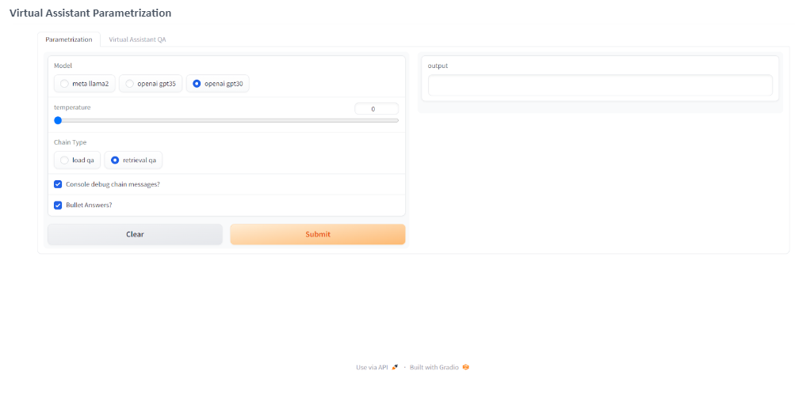
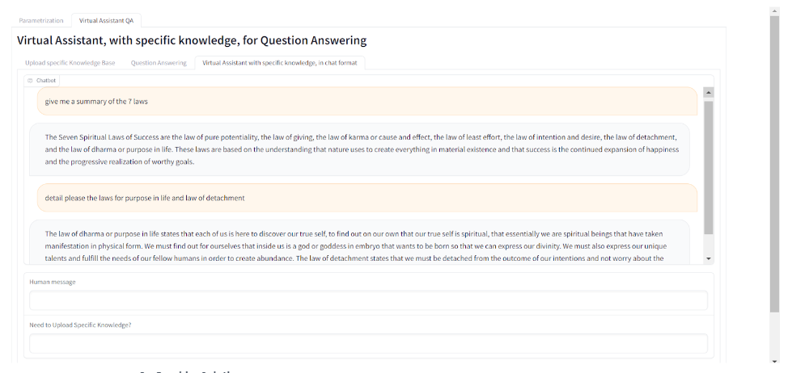

# Virtual-Assistant LLAMA2/OpenAI with specific knowledge (RAG)
Open-Source RAG with LLaMa 13B (4 bits for less GPU memory), Faiss, HuggingFace and Langchain or with OpenAI. With gradio UI

## 🤔 What is this?
**Description:**  
In this Poc we'll create a RAG Open-Source solution with **Llama-13b-chat** with HuggingFace embedings, Faiss (Vector DB), all orchestrated by LangChain. Or we could parametrize with OpenAI.With gradio UI.

In terms of struture of the solution, we have the main UI in file `RAG_QAw_Parametrization.ipynb` that import all the parametrization (which model, temperature, chain...) from `parametrization.ipynb`  and the core RAG functions from `RAGQA.ipynb`. `RAGQA.ipynb` import also `Parametrization.ipynb`.    

**Retrieval Augmented Generation (RAG)** is an advanced Natural Language Processing (NLP) technique that combines both retrieval and generation elements to enhance AI language models' capabilities.

## 📚 Data

We can import your own knowledge database with the solution.

##  🚀 Quick Install

Due to the power of GPU needed i advise you to use colab with `RAG_QAw_Parametrization.ipynb`(for Llama2). Need to insert your huggingface key

## 📖 Documentation / UI

🧮 **Virtual Assistant Parametrization UI**: 

 

🧮 **Virtual Assistant Question Anwsering UI**: 

 

Please see the description in .ipynb about this project.

##  🚀 Results 

LLama2 with 4096 token on window prompt show a natural improvement in VA Open Source
